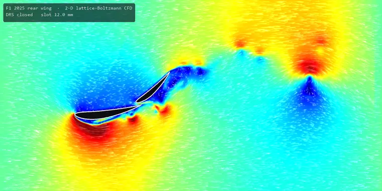
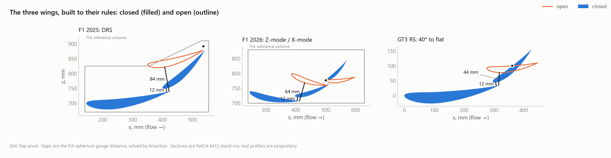
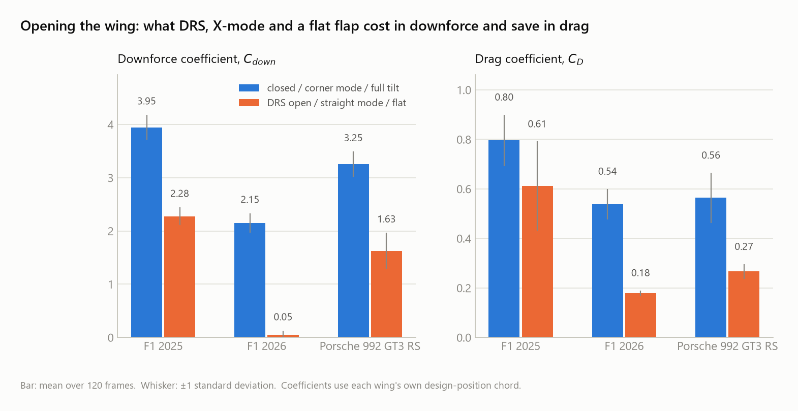
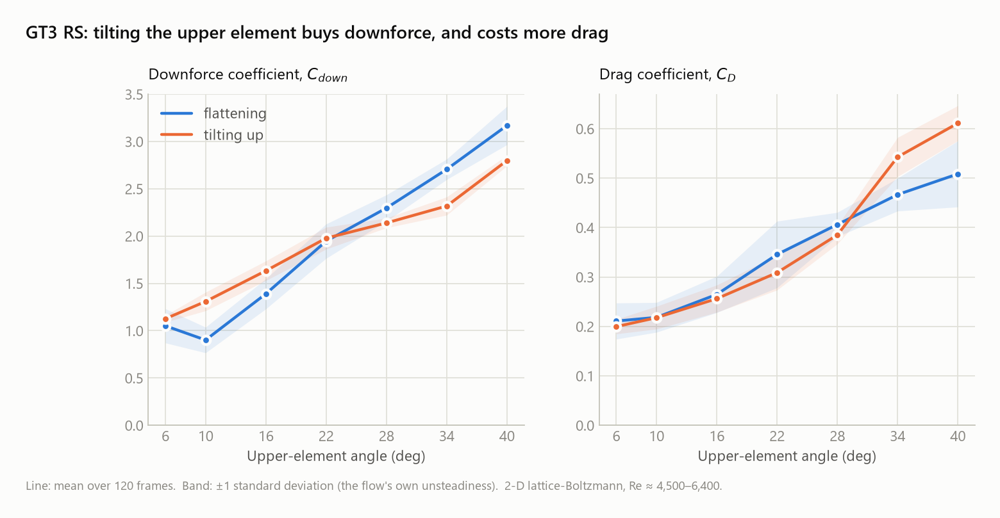
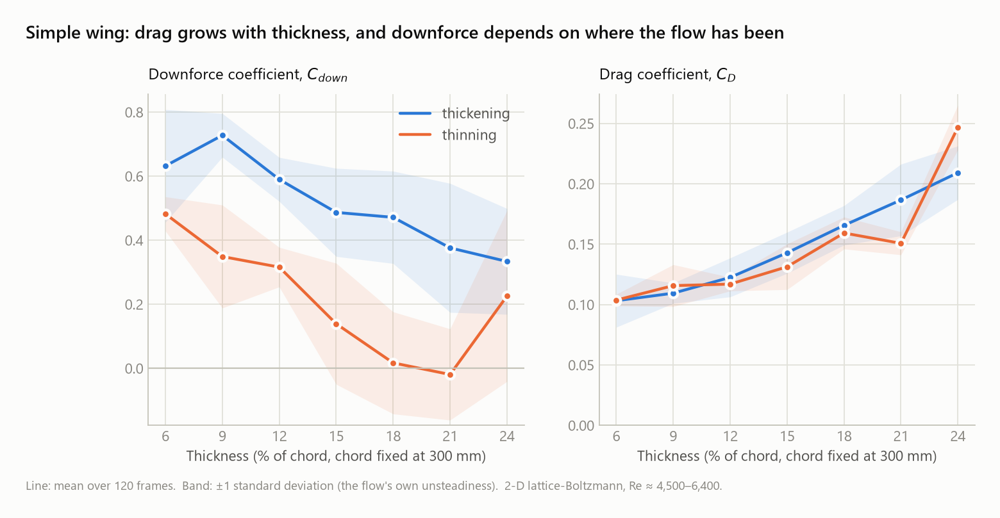

# Aeroflynamics

**How does the shape of a rear wing set its downforce and drag?**
A 2-D computational fluid dynamics study of F1 and Porsche GT3 RS rear wings.

<p align="center">
  
</p>

<p align="center"><sub>The F1 2025 rear wing opening DRS. Colour is flow speed, from still air
(navy) to fast (red); the white streaks trace where the air goes. Nothing is animated by hand: every
vortex is the solver's output.</sub></p>

I love racing. My IB Mathematics IA investigated the downforce an F1 rear wing makes, and this
project extends it: instead of taking a wing's performance as given, it computes the airflow around
the wing and measures the force that airflow produces.

### Key findings

- **Opening the wing trades downforce for drag, by very different amounts per wing.** F1 2025 DRS
  removes 42% of the downforce and 24% of the drag. The 2026 F1 X-mode removes 98% and 67%. The
  GT3 RS flat flap removes about half of each.
- **The GT3 RS flap trades steadily.** From flat to full tilt, downforce and drag both rise
  smoothly, each by about 2.5–3×.
- **Wings remember.** The same flap angle or thickness gives a different force depending on the
  direction you arrived from. Thinning a wing back down from 24% thickness recovered almost none of
  its downforce: at 21% it measured 0.38 on the way up and 0.0 on the way down.
- **At this scale, thin wins.** With the chord fixed, drag grows with thickness, and on the way
  up downforce peaks at about 9% thickness.

---

## 1. Questions

1. How much downforce and drag does **opening** a rear wing cost? Compared across F1 2025 DRS,
   F1 2026 active aero (X-mode) and the Porsche 992 GT3 RS flap.
2. How do downforce and drag change across the GT3 RS flap's **34° of travel**, and does the
   direction of travel matter?
3. If only a wing's **thickness** changes, with its chord, camber and angle held fixed, what
   happens to downforce and drag?

## 2. Background: the downforce equation

A wing's downforce $D$ and drag $F_D$ follow the same law:

$$D = C_{\text{down}} \cdot \tfrac12\,\rho\,V^2 \cdot A, \qquad F_D = C_D \cdot \tfrac12\,\rho\,V^2 \cdot A$$

Here $\rho$ is the air density, $V$ the speed and $A$ the wing's planform area (chord × span).
Speed and size are easy to measure. All of the aerodynamics hides inside the two coefficients
$C_{\text{down}}$ and $C_D$, which depend only on the wing's **shape** and how the air flows
around it. So the question "how does shape change downforce?" is really "how does shape change
$C_{\text{down}}$ and $C_D$?". Answering that needs the flow itself.

Because $D \propto V^2$, doubling the speed quadruples the downforce, at any shape.

## 3. Method

### 3.1 Simulating the air: the lattice-Boltzmann method

The air is simulated on a grid of 640 × 320 cells, each 2.5 mm across. Instead of solving the
Navier–Stokes equations directly, the lattice-Boltzmann method tracks how many particles move in
each of 9 directions $\mathbf{c}_i$ at every cell (the D2Q9 model). Each time step has two parts:
the particles **stream** to the neighbouring cell, then **collide**, relaxing toward a local
equilibrium:

$$f_i(\mathbf{x}+\mathbf{c}_i,\ t+1) = f_i(\mathbf{x},t) - \frac{1}{\tau}\Big(f_i(\mathbf{x},t) - f_i^{\text{eq}}(\mathbf{x},t)\Big)$$

$$f_i^{\text{eq}} = w_i\,\rho\left(1 + 3\,\mathbf{c}_i\!\cdot\!\mathbf{u} + \tfrac{9}{2}(\mathbf{c}_i\!\cdot\!\mathbf{u})^2 - \tfrac{3}{2}\,|\mathbf{u}|^2\right)$$

Density and velocity are sums over the 9 directions:

$$\rho = \sum_i f_i, \qquad \rho\,\mathbf{u} = \sum_i \mathbf{c}_i f_i$$

The relaxation time $\tau$ sets the viscosity, $\nu = (\tau - \tfrac12)/3$, so choosing a Reynolds
number fixes it:

$$\mathrm{Re} = \frac{U L}{\nu} \quad\Rightarrow\quad \tau = \frac{3\,U L}{\mathrm{Re}} + \frac12$$

With $U = 0.075$ cells per step, $L = 160$ cells (400 mm) and $\mathrm{Re} = 6000$, this gives
$\nu = 0.002$ and $\tau = 0.506$. That close to $\tfrac12$, plain LBM goes unstable, so a
Smagorinsky turbulence model adds viscosity exactly where the flow shears hardest:
$\nu_t = (C_s\Delta)^2\,|S|$, with $C_s = 0.16$.

LBM is only accurate at low Mach number. Here $\mathrm{Ma} = U/c_s = 0.075\sqrt3 = 0.13$, so the
compressibility error, which scales like $\mathrm{Ma}^2$, is about 1.7%.

### 3.2 From grid units to the real world

The coefficients have no units, so the simulated speed never has to equal a real car's speed: the
real speed only enters at the very end, through $\tfrac12\rho V^2$. For scale, one solver step at
250 km/h stands for

$$\Delta t = \frac{\Delta x \cdot U_{\text{grid}}}{V_{\text{real}}} = \frac{0.0025 \times 0.075}{69.4} \approx 2.7\ \mu\text{s}$$

### 3.3 Measuring the force on the wing

The wing is a **bounce-back** wall: a particle that would enter it is sent back the way it came.
Each bounce reverses the particle's momentum, and the wing absorbs the difference. Summing over
every link $(\mathbf{x}, i)$ that crosses the wing's surface gives the total force (momentum
exchange):

$$\mathbf{F} = \sum_{\text{boundary links}} \mathbf{c}_i\,\big(f_i^{*}(\mathbf{x}) + f_{\bar i}(\mathbf{x})\big)$$

$f_i^{*}$ is the population heading into the wall after collision, and $f_{\bar i}$ is the one
bounced back. Dividing by the dynamic pressure gives the coefficients. The minus sign is there
because a rear wing pushes **down**:

$$C_D = \frac{F_x}{\tfrac12 \rho U^2 c}, \qquad C_{\text{down}} = -\,\frac{F_y}{\tfrac12 \rho U^2 c}$$

This force measurement is checked against an independent method (see [Validation](#7-validation)).
The first version of it gave a drag **three times too high** that looked completely believable.

### 3.4 Building the wings

Every wing section is a NACA 4-digit airfoil. With $x$ running from 0 to 1 along the chord, the
thickness either side of the camber line is

$$y_t = 5t\left(0.2969\sqrt{x} - 0.1260\,x - 0.3516\,x^2 + 0.2843\,x^3 - 0.1036\,x^4\right)$$

The camber line $y_c$ is two parabolas that meet at the point of maximum camber $p$:

$$y_c = \begin{cases} \dfrac{m}{p^2}\left(2px - x^2\right) & x < p \\[2mm] \dfrac{m}{(1-p)^2}\left((1-2p) + 2px - x^2\right) & x \ge p \end{cases}$$

The thickness is applied perpendicular to the camber line, with $\theta = \arctan(dy_c/dx)$:

$$x_u = x - y_t\sin\theta,\quad y_u = y_c + y_t\cos\theta, \qquad x_l = x + y_t\sin\theta,\quad y_l = y_c - y_t\cos\theta$$

Each section is then flipped ($z \to -z$, so it pushes down instead of up), rotated by its angle
$\alpha$, and scaled to its chord $c$:

$$\begin{pmatrix} x' \\ z' \end{pmatrix} = c \begin{pmatrix} \cos\alpha & -\sin\alpha \\ \sin\alpha & \cos\alpha \end{pmatrix} \begin{pmatrix} x \\ -y \end{pmatrix}$$

**Fitting the rules.** The FIA rules fix gaps and angles, not positions, so the code solves for the
positions. The slot gap $g$ is the shortest distance between two outlines, from point-to-segment
distances; it is what the FIA's spherical gauge measures. **Bisection** then finds the value that
hits each target:

- the height $h$ that sets the closed slot to exactly $g(h) = 12$ mm (rule: 10–15 mm);
- the flap rotation $\varphi$ that opens DRS to $g(\varphi) = 84$ mm (rule: ≤ 85 mm), and X-mode
  to 64 mm (rule: ≤ 65 mm);
- for 2026, each section's angle such that the steepest underside tangent in its last 40 mm sits
  1° under its cap (10°, 40°, 65°).

Each bisection step halves the interval, so 60 steps narrow an initial 160 mm range to
$160/2^{60} \approx 10^{-16}$ mm.

<picture>
  <source media="(prefers-color-scheme: dark)" srcset="docs/figures/geometry.dark.png">
  
</picture>

| wing | source of the geometry |
|---|---|
| F1 2025 | FIA 2025 Technical Regulations Art. 3.10: two sections, 10–15 mm slot, DRS ≤ 85 mm |
| F1 2026 | FIA 2026 Technical Regulations Issue 8 Art. 3.11: three sections, rear two rotate together, X-mode slot ≤ 65 mm, trailing-edge caps 10° / 40° / 65° |
| GT3 RS | Porsche press kit (fixed main plane, upper element with 34° of travel); chords (318 / 170 mm) and span (1,712 mm) are a forum estimate from photographs |

Real team and Porsche profiles are proprietary, so every section is a public NACA 6412 stand-in.

**Holding size fixed while changing thickness.** The thickness $t$ appears only as the factor in
front of $y_t$, so changing it cannot change the chord, camber or angle. It does change the
cross-section area, linearly:

$$A = c^2 \int_0^1 2\,y_t\,dx = 10\,t\,c^2\left(\tfrac{2}{3}(0.2969) - \tfrac{0.1260}{2} - \tfrac{0.3516}{3} + \tfrac{0.2843}{4} - \tfrac{0.1036}{5}\right) \approx 0.681\,t\,c^2$$

For the 300 mm test wing, that is 37 cm² at 6% thickness and 147 cm² at 24%.

### 3.5 Measurement protocol

The flow around a lifting wing is unsteady: vortices shed off it continuously, so the force
wobbles. Every data point therefore follows the same protocol:

1. Move the flap or thickness to the target slowly (0.6° or 0.1% of chord per frame), so each step
   is a small change to the wall.
2. Wait **150 frames** (1,500 solver steps) for the flow to adjust; **300** after switching wings.
3. Record the instantaneous coefficients for **120 frames** and report their **mean** and
   **standard deviation**.

The standard deviation measures the flow's own unsteadiness, not instrument noise. Each sweep
runs **both ways** (up, then back down) in one continuous simulation, so any dependence on
history shows up directly.

## 4. Results

### 4.1 Opening the wing

<picture>
  <source media="(prefers-color-scheme: dark)" srcset="docs/figures/drs.dark.png">
  
</picture>

At 250 km/h, with each wing's real chord and span:

| wing | state | $C_{\text{down}}$ | $C_D$ | downforce | drag |
|---|---|---|---|---|---|
| F1 2025 | DRS closed | 3.95 | 0.80 | 4,443 N (453 kg) | 896 N |
| | DRS open | 2.28 | 0.61 | 2,563 N (261 kg) | 688 N |
| F1 2026 | Z-mode (corner) | 2.15 | 0.54 | 2,383 N (243 kg) | 596 N |
| | X-mode (straight) | 0.05 | 0.18 | 56 N (6 kg) | 197 N |
| GT3 RS | full tilt (40°) | 3.25 | 0.56 | 7,025 N (716 kg) | 1,217 N |
| | flat | 1.63 | 0.27 | 3,509 N (358 kg) | 576 N |

Worked example, F1 2025 with DRS closed:

$$q = \tfrac12 (1.225)\left(\tfrac{250}{3.6}\right)^2 = 2954\ \text{Pa}, \qquad D = 3.95 \times 2954 \times (0.397 \times 0.960) = 4443\ \text{N} \approx 453\ \text{kg}$$

### 4.2 The GT3 RS flap angle

<picture>
  <source media="(prefers-color-scheme: dark)" srcset="docs/figures/gt3rs_flap.dark.png">
  
</picture>

### 4.3 Thickness, with everything else fixed

<picture>
  <source media="(prefers-color-scheme: dark)" srcset="docs/figures/thickness.dark.png">
  
</picture>

Every number above comes from [`docs/figures/data/`](docs/figures/data), written by the solver.

## 5. Discussion

**Opening a wing is not one trade-off.** The F1 2025 DRS flap pivots about its trailing edge,
so opening it mostly lifts the flap's leading edge, and the main plane does not move at all. 58%
of the downforce survives, while drag falls only 24%. The 2026 X-mode rotates two of the three
sections at once and leaves almost no downforce at all (98% gone), which matches its purpose:
a pure low-drag straight-line mode. The GT3 RS flattening halves both downforce and drag, so its
downforce-to-drag ratio barely moves (5.8 → 6.1).

**More flap angle, more of both.** Across the GT3 RS flap's travel, downforce grows almost
linearly with angle: a least-squares fit gives 0.05–0.07 of $C_{\text{down}}$ per degree,
depending on the direction of travel. Drag grows with it, so the downforce-to-drag ratio stays
between about 4.1 and 6.4 at every angle measured. The flap is a dial for how much of both you
want, not a free lunch.

**The flow has a memory (hysteresis).** At high angles, the GT3 RS made more downforce when
flattening from 40° than when tilting up to the same angle: 3.17 against 2.80 at 40°. The
thickness sweep shows it far more strongly. Once the 24% section's flow had separated, thinning
the wing did not reattach it: at 21% the downforce was 0.38 on the way up and 0.0 on the way down.
A likely reason: separated flow is self-sustaining, because the recirculating region shields
itself from the fast outer flow that would reattach it. The same mechanism makes real wings
stall at one angle and recover only at a lower one. Each point here allowed about 1–2 chord
lengths of air to pass; whether these states would recover given much longer is an open question.

**Why thin wins here.** On the way up, downforce peaks near 9% thickness and then falls, while
drag climbs steadily. At this simulation's Reynolds number (≈ 4,500), the boundary layer is thick
and separates early off a fat section. At a real car's Reynolds number (≈ 1.4 million) the
boundary layer is far thinner, and thicker sections keep their flow attached much better. So this
trend is a property of small, slow, viscous flow, not a design rule for race cars.

**Comparison with Porsche.** The 2-D GT3 RS wing alone reads about 716 kg at 250 km/h. Porsche
quotes 860 kg for the **whole car** at 285 km/h, which scales by $V^2$ to about 662 kg at
250 km/h. The simulation overestimates for two reasons: a 2-D slice has no wing-tip losses, and
the tunnel walls squeeze the flow. Its low Reynolds number pulls the other way. Treat the Newton
values as order-of-magnitude; the **trends and comparisons** are the result.

## 6. Limitations

| | this study | a real car |
|---|---|---|
| dimensions | 2-D slice through the wing | 3-D wing with endplates and tip vortices |
| Reynolds number | ≈ 4,500 – 6,400 | ≈ 1.4 – 2 million |
| surroundings | free stream, tunnel walls up to ~25% blockage | car body, rear tyres, open road |
| profiles | public NACA 6412 / 44xx stand-ins | proprietary sections |
| resolution | 2.5 mm cells, so a 12 mm slot is ~5 cells wide | — |

## 7. Validation

A CFD picture is persuasive whether or not it is right, so the solver is checked against problems
with known answers before any wing is trusted (`windtunnel/tools/validate.py`, 14/14 passing):

| case | measured | reference |
|---|---|---|
| cylinder vortex shedding, Strouhal number | 0.1907 | 0.1854 |
| cylinder mean drag $C_D$ | 1.455 | 1.33 (7% wall blockage inflates it) |
| symmetric NACA 0012 at 0°, lift | −0.0000 | 0 |
| lift antisymmetry, $C_L(+\alpha) + C_L(-\alpha)$ | 0.0000 | 0 |

The force measurement in §3.3 was caught being 3× too large by comparing it with a second,
independent method (a control-volume momentum balance). The cause was a mismatch between the wall
boundary condition and its force sum. The fix was to make them the same scheme, not to scale the
answer. The full story is in [`windtunnel/README.md`](windtunnel/README.md#why-the-validation-harness-exists).

The wing geometry has its own checks. `interactive.py --wings --selftest` verifies every FIA limit
the F1 sections were built to, and that opening each wing lowers both downforce and drag.

## 8. Explore it and reproduce it

```
cd windtunnel
pip install -r requirements.txt numba matplotlib

python interactive.py --wings          # the three wings live: Tab, D for DRS, Up/Down GT3 RS flap
python interactive.py --thickness      # one wing with a thickness slider
python tools/make_figures.py all       # re-run every sweep and redraw every figure (slow)
python tools/validate.py               # the validation suite
```

The solver, the scenes and the validation are documented in
[`windtunnel/README.md`](windtunnel/README.md).

## Credits and licence

The visual style follows the physics animations of
[spectrometry.mp4](https://github.com/ec175/spectrometry_public). Parts of the solver are adapted
from that project's MIT-licensed code; the details and its licence are in
[`windtunnel/README.md`](windtunnel/README.md#credits). This project is released under the
[MIT licence](LICENSE).
